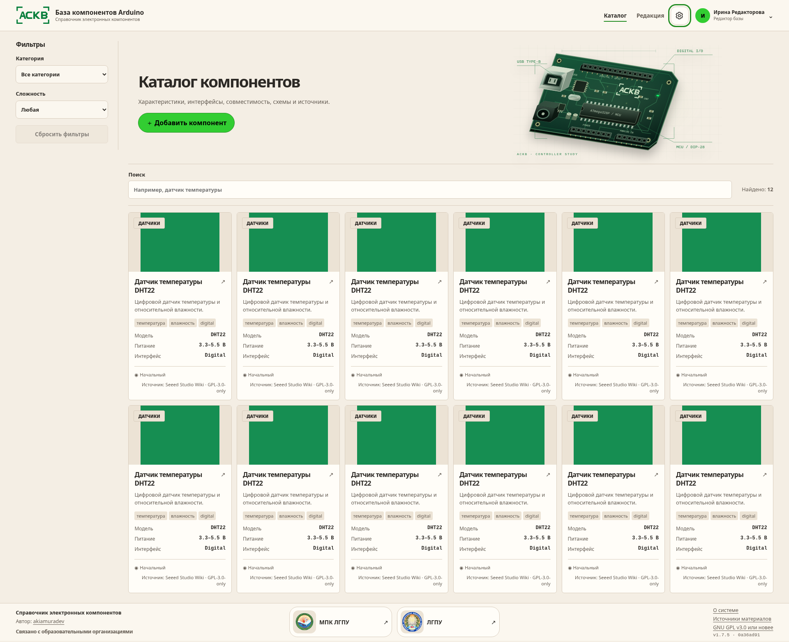
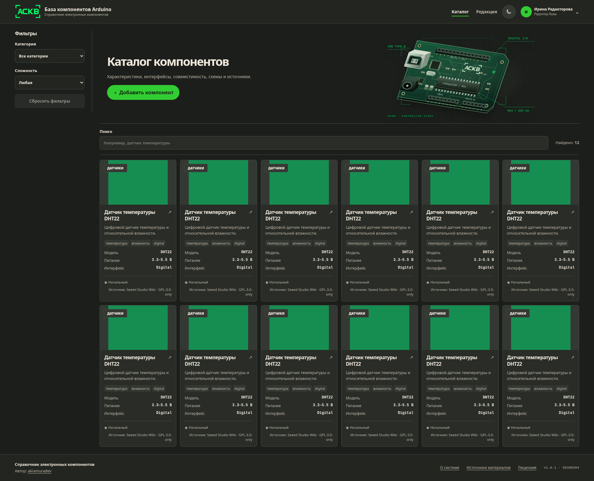
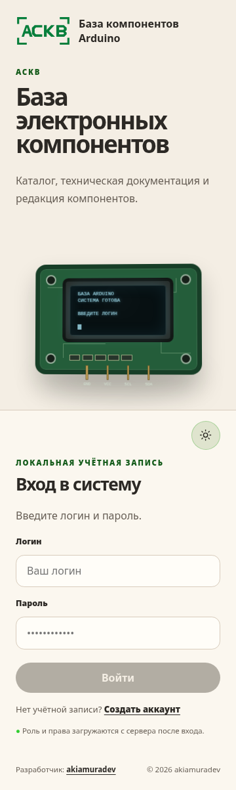
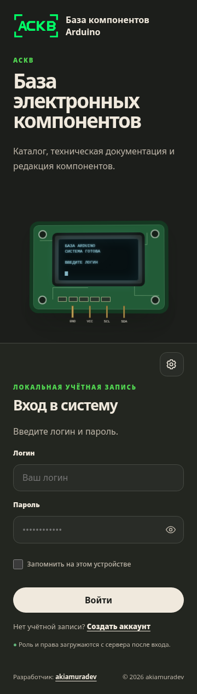

# Arduino Component Knowledge Base

[](https://github.com/akiamuradev/arduino-component-knowledge-base/actions/workflows/quality.yml?query=branch%3Arelease%2F1.0.0)
[](LICENCE)

**English · [Русский](README.ru.md)**

A self-hosted educational catalogue for reviewed information about Arduino-compatible boards,
sensors, actuators, displays, and related electronic components.

## About the project

Arduino Component Knowledge Base (ACKB) gives students a searchable catalogue while teachers,
editors, and administrators maintain the material through a controlled review process. The
current application version is **1.0.0**.

A clean installation contains categories and approved source definitions, but no fabricated or
automatically published cards. Imported material always starts as a draft; it becomes visible to
students only after review, approval, and explicit publication.

## Highlights in v1.0.0

- responsive Russian-language React interface with light, dark, and system themes;
- catalogue search, category and difficulty filters, component pages, and multiple-image galleries;
- server-enforced roles for students, teachers, temporary editors, and administrators;
- student-only public registration plus administrator-controlled password reset and admin creation;
- draft, review, approval, publication, hide, archive, and immutable revision history;
- teacher correction proposals that never overwrite published content directly;
- bounded Seeed Studio Wiki and KiCad Symbols imports with provenance and license snapshots;
- exact and fuzzy duplicate detection with administrator-only merge decisions;
- private MinIO media, validated image/video processing, and durable Redis/Dramatiq jobs;
- audit events, Argon2id passwords, opaque sessions, CSRF protection, and throttling;
- reproducible Docker Compose deployment, Alembic migrations, backup, restore, and upgrade checks.

## Screenshots

| Catalogue — light theme | Catalogue — dark theme |
|---|---|
|  |  |

| Sign in — mobile light theme | Sign in — mobile dark theme |
|---|---|
|  |  |

The screenshots are generated by the repository's deterministic Playwright scenario; production
code contains no mock catalogue data.

## Architecture

| Layer | Technology |
|---|---|
| Web interface | React 19, TypeScript 6, Vite |
| API and authorization | FastAPI, Pydantic, SQLAlchemy 2, asyncpg |
| Persistent data | PostgreSQL 17 with Alembic migrations |
| Media | Private MinIO buckets, Pillow, FFmpeg |
| Background work | Redis 8 and Dramatiq |
| Edge | nginx and Docker Compose |

```text
Browser -> reverse proxy -> frontend
                         -> backend -> PostgreSQL
                                    -> Redis -> workers
                                    -> private MinIO
```

The backend is the authorization source of truth. Parser output cannot publish a card, and a
duplicate merge always requires a separate administrator decision. See
[Architecture](docs/ARCHITECTURE.md) and [Security](docs/SECURITY.md) for the full boundaries.

## Quick start

Requirements: Docker Engine, the Docker Compose plugin, Git, `curl`, and `openssl`. Clone the
default branch into a native Linux filesystem:

```bash
git clone --branch main --single-branch \
  https://github.com/akiamuradev/arduino-component-knowledge-base.git
cd arduino-component-knowledge-base
bash scripts/linux_bootstrap.sh
```

The bootstrap creates an ignored `.env` with random local credentials and mode `0600`, builds the
stack, and waits for the health checks. It does not print generated secrets. Open
<http://localhost:8080>.

Verify the deployment:

```bash
docker compose ps -a
curl -f http://127.0.0.1:8080/health
curl -f http://127.0.0.1:8080/ready
python3 scripts/compose_smoke.py
```

`migrate` and `media-init` are one-shot services; `Exited (0)` is their successful state. For an
existing release checkout, preserve its `.env` and volumes:

```bash
git pull --ff-only origin main
docker compose up --build -d
python3 scripts/compose_smoke.py
```

Do not replace `.env` while reusing an existing PostgreSQL volume. For production deployment,
backup, restore, and upgrade procedures, use the [Operations guide](docs/OPERATIONS.md).

## Create the first administrator

After the stack is healthy:

```bash
docker compose run --rm backend ackb-bootstrap-admin \
  --login admin --display-name "Initial Administrator"
```

Enter the password twice through the TTY. It must contain 12–128 characters and is never accepted
as a command-line argument. Bootstrap is available only while no active administrator exists.

Students can create an account at `/register` with only a login and password; the backend always
assigns the `student` role. Existing administrators manage password resets and additional
administrator accounts in the protected workspace. Password reset revokes all target sessions;
there is no self-service recovery or collection of email, phone, 2FA, or recovery-code data.

## Content workflow

1. An editor or administrator creates a manual draft or a bounded Seeed/KiCad import preview.
2. The selected import entry becomes a draft; it is never published automatically.
3. The editor completes the card and resolves duplicate candidates.
4. The editor submits it for review; an administrator requests changes or approves it.
5. An administrator explicitly publishes the approved revision.
6. Students see the immutable published snapshot. Later edits begin a new draft; hide and archive
   actions remain reversible.

## Development and checks

Use Python 3.12 or newer, [uv](https://docs.astral.sh/uv/), Node.js `>=22.12 <26`, npm, and Docker.

Backend and documentation checks:

```bash
uv lock --check
uv sync --frozen --extra dev
uv run ruff check .
uv run ruff format --check src scripts tests migrations
uv run mypy --strict src scripts tests migrations
uv run pytest
uv run python -m build
uv run python scripts/docs_contract.py
uv run python scripts/release_contract.py
uv run python scripts/backend_smoke.py
```

Frontend and browser checks:

```bash
cd frontend
npm ci
npm run audit
npm run lint
npm run typecheck
npm test
npm run build
npm run smoke
npx playwright install chromium
npm run test:e2e
```

Container checks and the PostgreSQL/MinIO integration environment are documented in
[Testing](docs/TESTING.md). The `quality` workflow runs the complete mandatory release gate on
every push and pull request.

## Documentation

- [Requirements](docs/REQUIREMENTS.md)
- [Architecture](docs/ARCHITECTURE.md)
- [Data model](docs/DATA_MODEL.md)
- [Testing](docs/TESTING.md)
- [Security controls](docs/SECURITY.md) and [threat model](docs/THREAT_MODEL.md)
- [Operations](docs/OPERATIONS.md) and [deployment](docs/DEPLOYMENT.md)
- [Import validation](docs/IMPORT_VALIDATION.md) and [import roadmap](docs/imports/ROADMAP.md)
- [Data licensing](docs/DATA_LICENSING.md) and [third-party notices](THIRD_PARTY_NOTICES.md)
- [Contributing and forks](CONTRIBUTING.md)

## Contributing and forks

To contribute upstream, create a GitHub fork, clone your fork, add this repository as `upstream`,
and branch from `upstream/main`:

```bash
git clone https://github.com/<username>/arduino-component-knowledge-base.git
cd arduino-component-knowledge-base
git remote add upstream https://github.com/akiamuradev/arduino-component-knowledge-base.git
git fetch upstream
git switch -c feature/<short-name> upstream/main
```

Do not push feature work directly to `main`. Keep one pull request focused on
one task, synchronize with `git fetch upstream`, and run the relevant checks above before opening
a PR. Never commit `.env`, credentials, generated build output, or user data.

An independent fork or derivative remains subject to the
[PolyForm Noncommercial License 1.0.0](LICENCE): commercial use is not permitted. Imported data
keeps its own license, attribution, and provenance. Replace all credentials before a public
deployment, follow the security/deployment requirements, and do not imply affiliation with
Arduino, Seeed Studio, KiCad, or the original author. Renaming the product requires consistent
updates to branding, package metadata, Compose image names, frontend metadata, versions, and
documentation.

See [CONTRIBUTING.md](CONTRIBUTING.md) for the complete upstream and independent-fork workflows.

## Security

Never publish credentials, personal data, or exploit details in an issue or pull request. Review
the trust boundaries in [Security](docs/SECURITY.md) before changing authentication, imports,
media, or deployment. A green CI run does not replace TLS, secret rotation, backups, network
policy, monitoring, and the production preflight checks.

## License and third-party material

Application code is distributed under the
[PolyForm Noncommercial License 1.0.0](LICENCE). Commercial use is not permitted by this license.

Imported third-party material is not relicensed as application code. See
[Data licensing](docs/DATA_LICENSING.md) and [Third-party notices](THIRD_PARTY_NOTICES.md) for
source-specific licenses, attribution, and provenance requirements.
