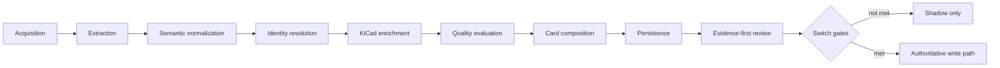
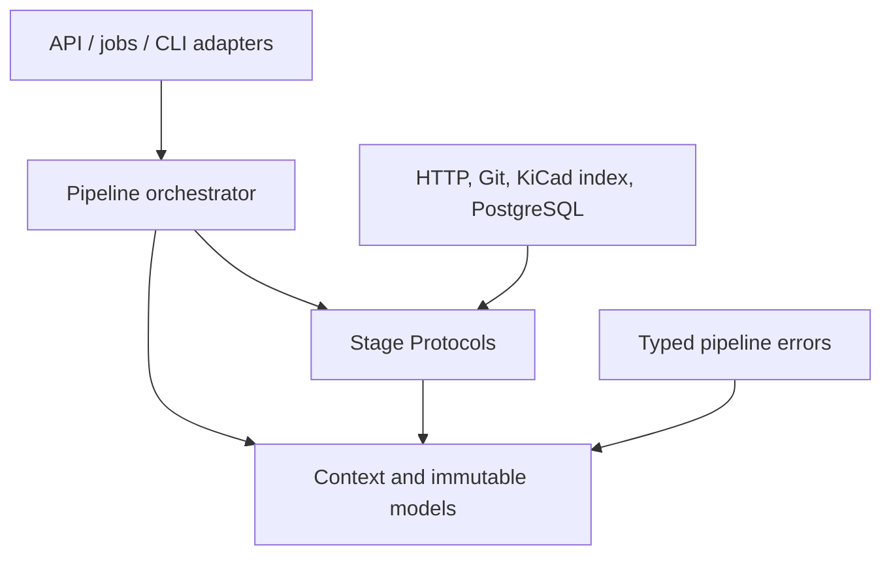
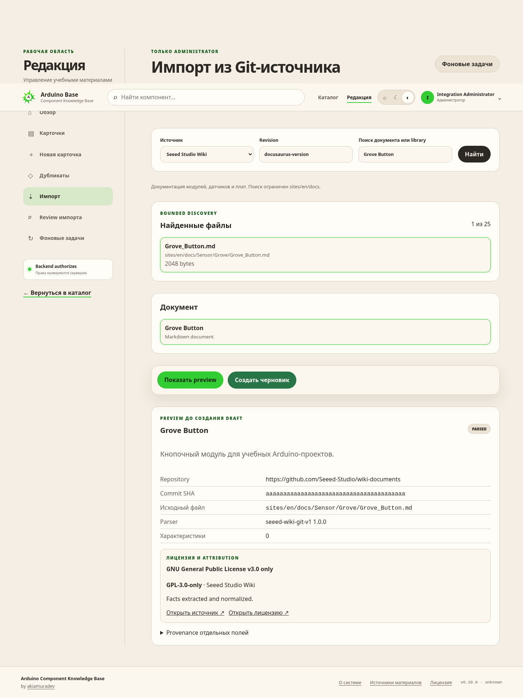
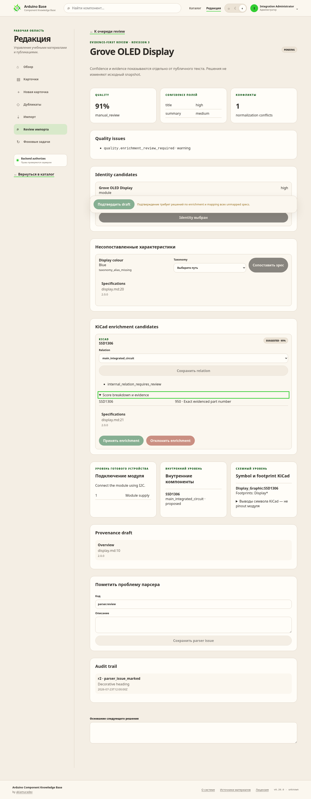

# ROADMAP evidence-first импорта компонентов

Этот документ — единая точка правды для рефакторинга импортного конвейера Arduino Component
Knowledge Base. Он заменяет 13 разрозненных документов в `docs/imports`, фиксирует результат XRAY
на 2026-07-23 и определяет следующий порядок разработки.

Текущая версия приложения: `0.21.0`.

## Как читать статусы

- **done** — код, контракты и focused-тесты этапа реализованы;
- **active** — функциональность доступна, но ещё не готова стать основным production-потоком;
- **blocked** — переключение запрещено до выполнения явно перечисленных условий;
- **planned** — реализация ещё не начата.

## Текущий срез

| Этап | Результат | Статус |
| ---: | --- | --- |
| 0 | Baseline legacy/repository-импорта и golden fixtures | done |
| 1 | Архитектурные границы и типизированные stage-контракты | done |
| 2 | Immutable evidence-first модель `ExtractedFacts` | done |
| 3 | Безопасный Seeed Markdown/MDX extractor | done |
| 4 | Версионированная семантическая нормализация | done |
| 5 | Взвешенное определение identity, kind и category | done |
| 6 | Индекс и provider KiCad enrichment | done |
| 7 | Объяснимый Seeed↔KiCad matcher | done |
| 8 | Детерминированная оценка качества | done |
| 9 | Компоновка immutable review draft | done |
| 10 | Идемпотентное PostgreSQL persistence и enrichment lifecycle | done |
| 11 | Полный orchestrator и shadow mode | active / blocked for primary |
| 12 | Evidence-first admin review workspace | done |
| 13 | Реальные метрики, калибровка и switch-readiness | active: 13.1–13.2 done, 13.3 next |
| 14 | Контролируемое переключение authoritative pipeline | planned |
| 15 | Удаление legacy-слоя после окна отката | planned |

На текущем этапе legacy repository parser и `persist_repository_draft()` остаются единственным
authoritative-путём создания каталожной карточки. Новый pipeline может работать только с
`ACKB_IMPORT_PIPELINE_MODE=disabled` (по умолчанию) или `shadow`. Значение `primary` намеренно
не поддерживается.

Stage 12 позволяет подтвердить evidence-first draft, но подтверждение:

- не создаёт и не публикует каталожный component;
- не связывает review draft с существующей карточкой;
- не переключает worker на новый pipeline;
- не меняет immutable facts, identity, quality или candidate payload.

## Результат XRAY папки `docs/imports`

До консолидации план состоял из 13 Markdown-файлов и 1655 строк. Они описывали один
последовательный процесс, но повторяли rollout-правила, статусы и команды проверки. Ранние этапы
корректно говорили «не подключено к production» на момент своей реализации, но после Stage 11 и
Stage 12 это стало историческим утверждением, а не текущим состоянием.

В единый документ перенесены все уникальные контракты из прежних файлов:

| Прежний файл | Раздел в этом ROADMAP |
| --- | --- |
| `current-state.md` | Stage 0, compatibility и исходный технический долг |
| `target-architecture.md` | Архитектура, зависимости, stage-контракты и rollout |
| `extracted-facts.md` | Stage 2 |
| `seeed-extractor.md` | Stage 3 |
| `normalization.md` | Stage 4 |
| `identity-resolution.md` | Stage 5 |
| `kicad-enrichment.md` | Stage 6 |
| `kicad-matcher.md` | Stage 7 |
| `quality-evaluation.md` | Stage 8 |
| `card-composition.md` | Stage 9 |
| `persistence.md` | Stage 10 |
| `orchestration-shadow.md` | Stage 11 |
| `review-workspace.md` | Stage 12 |

Главный вывод XRAY: Stage 0–12 реализованы последовательно и не требуют нового переписывания.
Следующая полезная работа — не добавлять ещё один parser layer, а получить реальные reviewer
outcomes, обеспечить online-worker актуальным KiCad index и доказать готовность к переключению.

## Целевая архитектура

Seeed Wiki является первичным источником карточки. KiCad — enrichment provider для identity,
извлечённой из Seeed, а не источник массового создания самостоятельных карточек. Только
composition может формировать publication-facing поля.



Основной код расположен в `src/arduino_component_kb/imports/pipeline/`:

```text
pipeline/
├── context.py
├── errors.py
├── orchestration.py
├── runtime.py
├── shadow.py
├── worker_shadow.py
├── contracts/
│   ├── acquisition.py
│   ├── extraction.py
│   ├── normalization.py
│   ├── identity.py
│   ├── enrichment.py
│   ├── evaluation.py
│   ├── composition.py
│   └── persistence.py
├── extractors/
├── normalization/
├── identity/
├── enrichment/
├── evaluation/
├── composition/
├── persistence/
└── models/
```

Отдельный namespace `pipeline` защищает действующий production-код в `imports/acquisition.py`,
`imports/processor.py`, adapters и repository от преждевременной связанности.

### Направление зависимостей



Разрешено:

- domain context зависит только от standard library;
- stage contracts зависят только от domain context/result types;
- orchestration зависит от context и абстрактных шагов;
- инфраструктурные адаптеры реализуют contracts и могут использовать HTTP, filesystem, cache/ORM;
- API и worker подключаются к orchestrator через явный adapter/feature flag.

Запрещено:

- domain не импортирует FastAPI, SQLAlchemy, Redis, Dramatiq, HTTP client или catalogue ORM;
- extractor не вызывает persistence и не создаёт карточки;
- provider/evaluator не мутирует результат предыдущего этапа;
- enrichment не выдаёт KiCad symbol pins за pinout готового Seeed-модуля;
- новый поток не становится authoritative без Stage 14 и готового rollback.

### Общие stage-контракты

| Stage | Protocol | Method | Граница ответственности |
| --- | --- | --- | --- |
| acquisition | `SourceAcquirer[Request, Artifact]` | `acquire` | Получить bounded artifact, не интерпретируя component meaning |
| extraction | `FactExtractor[Artifact, Facts]` | `extract` | Извлечь evidenced raw facts из синтаксиса источника |
| normalization | `FactNormalizer[Facts, Normalized]` | `normalize` | Применить deterministic semantic rules и сохранить raw values |
| identity | `IdentityResolver[Normalized, Identity]` | `resolve` | Выдать explainable identity/category candidates |
| enrichment | `EnrichmentProvider[Input, Enrichment]` | `enrich` | Предложить внешние факты/relations без изменения карточки |
| evaluation | `QualityEvaluator[Input, Quality]` | `evaluate` | Оценить готовность, ничего не исправляя и не генерируя |
| composition | `CardComposer[Input, Draft]` | `compose` | Построить deterministic review draft |
| persistence | `ImportPersistenceGateway[Draft, Persisted]` | `persist` | Идемпотентно сохранить aggregate через infrastructure adapter |

`ImportPipelineContext` immutable и содержит только `run_id`, зарегистрированный source,
`pipeline_version`, время начала и упорядоченные `StageExecution`. Source payload и произвольные
данные в context не складываются. Стадии обязаны образовывать точный prefix канонического порядка,
не могут пересекаться и возвращают `StageResult[T]` с тем же run/source identity.

Все ошибки наследуют `ImportPipelineError`, имеют bounded machine code, stage/category,
явную retryability и безопасную сериализацию. Категории:
`AcquisitionError`, `ParsingError`, `NormalizationError`, `IdentityError`, `EnrichmentError`,
`QualityError`, `CompositionError`, `PersistenceError`.

## Сквозные инварианты

1. Parser никогда не публикует карточку; импорт создаёт только draft.
2. Нельзя генерировать отсутствующий source text или скрывать unknown data.
3. Каждый extracted/normalized факт хранит raw value и evidence.
4. Source revision разрешается до immutable full commit SHA.
5. License/attribution snapshot обязателен и не угадывается composer.
6. Module connection и KiCad symbol pinout — разные уровни данных.
7. Matcher decision и reviewer decision не переписывают immutable candidate payload.
8. Все mutation endpoints требуют administrator RBAC, session, CSRF и optimistic revision.
9. Повтор одного и того же pipeline input не создаёт новый aggregate.
10. Shadow failure не должен ломать legacy import и не может утекать raw source в лог.

## Stage 0 — baseline действующего импорта

### Два исходных пути

1. Legacy website import для allowlisted URL (Arduino-Tex, Portal-PK, AlexGyver).
2. Immutable repository import для Seeed Wiki и официальных KiCad symbol libraries.

Оба пути создают draft. Publication выполняется отдельно после проверки source licensing,
duplicate state и обязательных catalogue fields.

Repository discovery/preview разрешает revision до full SHA, bounded-образом находит разрешённые
файлы и возвращает `ParsedRepositoryComponent`, не создавая job/component/source relation.
Repository job проходит RBAC/CSRF/idempotency, очередь Dramatiq, acquisition, один legacy adapter,
Redis idempotency lock и `persist_repository_draft()`.

Legacy parser contract уже был близок к проекции карточки:

- Seeed: `title`, `summary`, `description`, `category_hint`, specifications и resources;
- KiCad: library/symbol identity, description, keywords, datasheet, footprints и pins;
- provenance и license snapshot добавлялись к projected fields;
- unknown/non-JSON frontend errors сворачивались в `request_failed`.

Baseline зафиксировал исходные дефекты:

- extraction, normalization, classification и card shaping были смешаны в adapter;
- Seeed часто делал `description = summary` и создавал fallback text;
- unknown/duplicate specifications терялись за `untrusted_specification_ignored`;
- semantic sections, module pins и resources сохранялись неполно;
- category выбиралась first-match keywords и часто становилась `other` без breakdown/review route;
- KiCad library prefix определял category, а symbol создавался как самостоятельная карточка;
- не было Seeed↔KiCad relation/lifecycle и границы module pinout/IC pinout;
- worker был монолитным, а UI — flattened preview;
- `request_failed` скрывал реальную backend-категорию ошибки.

Baseline regression oracle:

```bash
uv run pytest -q tests/test_repository_parser_baseline.py tests/test_repository_adapters.py
```

## Stage 1 — параллельный domain и contracts

Этап ввёл перечисленные выше protocols, immutable context, typed errors и строгую dependency
direction. Legacy routes, jobs, adapters и persistence не менялись. Это позволило строить новый
pipeline поэтапно и сравнивать его с baseline до любого production switch.

## Stage 2 — evidence-first `ExtractedFacts`

Schema: `extracted-facts/v1`.

| Model | Назначение |
| --- | --- |
| `SourceReference` | Source key, URL/path и optional immutable revision |
| `SourceArtifactMetadata` | Media type, SHA-256, byte length, timezone-aware acquisition time |
| `EvidenceFragment` | Source, selector/section, exact raw text, extraction method, parser version |
| `ExtractedField[T]` | Structured value, raw representation и один или несколько evidence fragments |
| `RawSpecification` | Source label/value без taxonomy mapping и unit normalization |
| `ExtractionWarning` | Безопасный warning code/message с optional evidence |
| `ExtractedFacts` | Immutable совокупность фактов одного artifact |

Fact groups: title/summary candidates, description/features/applications/usage, identifiers,
manufacturer/brand, interfaces, module pinout, primary IC candidates, raw specifications,
resources, images, unmapped facts и warnings.

Каждый field имеет evidence из того же source, что artifact. Mixed-source facts отклоняются.
Extractor может разобрать таблицу, но не применяет aliases, не переводит единицы, не выбирает
category и не генерирует текст. Unknown specs остаются `RawSpecification`, остальные незнакомые
структуры — `UnknownFact`. JSON round-trip детерминирован, unknown schema version отклоняется.

Проверка:

```bash
uv run pytest -q tests/test_extracted_facts.py
uv run mypy src/arduino_component_kb/imports/pipeline tests/test_extracted_facts.py
```

## Stage 3 — Seeed evidence-first extractor

Parser: `seeed-facts-v2`, version `2.0.0`.

`SeeedFactExtractor` не исполняет YAML objects, imports/exports, JSX, expressions или fenced code.
Он читает bounded Markdown/MDX, простые scalar frontmatter, headings, paragraphs, lists, tables,
links и images. Executable constructs пропускаются с `executable_construct_ignored`; malformed
frontmatter можно восстановить по надёжному Markdown title.

| Output | Распознаваемые heading families |
| --- | --- |
| description | About, Description, Introduction, Overview, Product Description, What Is It |
| features | Feature(s), Key Features, Highlights |
| applications | Application(s), Use Cases, Typical Applications |
| specifications | Parameters, Specification(s), Technical Specifications |
| hardware facts | Hardware, Hardware Description/Overview/Structure |
| module pinout | Pin Definition, Pin Map, Pinout, Pins |
| usage | Getting Started, How to Use, Play With Arduino, Usage |
| resources | Documents, Downloads, References, Resource(s) |
| identity | Part List, Product Data, Product Information |

15-fixture corpus сохраняет 39 raw specs, 24 module pins, 33 semantic facts, 9 resources,
5 primary IC candidates, 4 identifiers, 3 images и 3 unmapped sections. На восьми общих baseline
fixtures новый extractor сохраняет 17 raw specs против 14 legacy normalized specs, 4 resources
против 0, 7 module pins, 12 semantic facts, 1 image и 2 unknown sections.

## Stage 4 — semantic normalization

Normalizer: `semantic-facts-v1`, rule/registry version `1.0.0`.

`SemanticFactNormalizer` возвращает immutable `NormalizedFacts`; полный `ExtractedFacts` встроен
без изменений и защищён SHA-256. Каждая нормализация хранит original/raw value, taxonomy path,
rule id/version, confidence и исходное evidence.

Profile-aware taxonomy различает sensor, display, actuator, board, communication и generic.
Unknown aliases становятся `UnmappedSpecification` с reason `taxonomy.alias-unmapped.v1`.

| Rule family | Пример | Результат |
| --- | --- | --- |
| `quantity.voltage.range.v1` | `3.3 to 5 volts` | `3.3–5 V` |
| `quantity.current.scalar.v1` | `20 milliamps` | `20 mA` |
| `quantity.temperature.range.v1` | `-40 to 85 °C` | `-40–85 °C` |
| `quantity.temperature.tolerance.v1` | `±0.5 degrees celsius` | `±0.5 °C` |
| `quantity.frequency.scalar.v1` | `16MHz` | `16 MHz` |
| `quantity.pressure.range.v1` | `300 to 1100 hPa` | `300–1100 hPa` |
| `quantity.percent.range.v1` | `0 to 100 percent` | `0–100 %` |
| `dimensions.axes.v1` | `21 x 17.8 millimeters` | `21 × 17.8 mm` |
| `interface.aliases.v1` | `I²C`, `SPI / UART` | `I2C`, `SPI`, `UART` |
| `manufacturer.aliases.v1` | `Seeed Technology Co. Ltd.` | `Seeed Studio` |
| `part-number.ascii-case.v1` | `esp32–c3` | `ESP32-C3` |

Разные values одного taxonomy path из разных source sections дают explicit
`incompatible_values`; ничего не выбирается и не сливается молча. Corpus: 36 mapped specs,
3 unmapped specs и 7 interfaces.

## Stage 5 — weighted identity и classification

Resolver: `weighted-identity-v1`, rules `1.0.0`.

Результат хранит canonical name/manufacturer, identifiers, отдельные primary IC candidates,
aliases, ranked kind/category candidates, полный score breakdown, resolution status и confidence.
Kinds: `module`, `development_board`, `discrete_component`, `integrated_circuit`, `connector`,
`generic_unknown`.

| Category signal | Вес |
| --- | ---: |
| title terminology | 55 |
| summary terminology | 20 |
| description/features/applications/usage | 10 |
| semantic taxonomy | обычно 20 |
| normalization profile | 15 |
| полный title равен evidenced primary IC | 85 |

Повтор одного signal family не наращивает score; total ограничен 100. Поддерживаются sensors,
displays, actuators, input, power, communication, boards, connectors, semiconductors и
integrated-circuits.

Thresholds:

- `auto_resolved`: category ≥65, отрыв от второй >15, kind ≥50, нет conflict/ambiguous title;
- `review_required`: category ≥35, но auto-условия не выполнены;
- `unresolved`: category <35 или kind generic/unknown.

Только auto result получает `selected_category`. Primary IC не копируется в module aliases и не
заменяет canonical module identity. Поэтому Grove OLED остаётся display module, а SSD1306 —
кандидатом enrichment.

Golden corpus: 12 auto-resolved, 2 review-required (`motor_shield`,
`without_specifications`) и 1 unresolved (`minimal_no_summary`). Он также покрывает connector,
development board, exact IC и false incidental matches.

## Stage 6 — KiCad enrichment index

Provider: `kicad-symbol-enrichment-v1`; parser: `kicad-index-v1.0.0`.

`KicadSymbolIndexer` принимает immutable snapshot официального KiCad repository и allowlisted
`.kicad_sym`. Один bounded S-expression pass строит records с identity/aliases/names, description,
keywords, manufacturer hints, datasheet, pins, footprint filters и source revision/hash/version.

Lookup maps покрывают exact part number, aliases, normalized names, description tokens и
manufacturer hints. Cache keyed by file SHA-256: exact snapshot даёт cache hit, новый revision
переразбирает только изменённые files, удалённые исчезают из index.

Provider возвращает match bases, но не score. Manufacturer может только дополнить существующий
identity/name match. Generic resistor/capacitor/inductor/LED/connector фильтруются без exact
evidenced identity.

Legacy KiCad-to-card path оставлен только для rollback compatibility и управляется
`ACKB_LEGACY_KICAD_CARD_IMPORT_ENABLED`.

Fixture benchmark (11 files / 10 symbols): 1.518 ms cold build, 0.065 ms exact-cache rebuild,
0.341 µs mean exact lookup / 10,000 iterations. Это smoke baseline, не production capacity.

```bash
uv run python scripts/benchmark_kicad_index.py /path/to/kicad-symbols \
  --revision <40-character-commit> --query SSD1306 --iterations 10000
```

## Stage 7 — Seeed↔KiCad matcher

Matcher rules: `1.0.0`.

| Relation | Meaning | Automatic decision |
| --- | --- | --- |
| `exact_component` | Один и тот же физический component | Только strict policy |
| `main_integrated_circuit` | Основной IC модуля/платы | Всегда review |
| `onboard_component` | Source явно говорит о компоненте на плате | Всегда review |
| `connector` | Relation к physical connector symbol | Всегда review |
| `functional_equivalent` | Доказано только functional/name similarity | Review или reject |

Confidence хранится целым числом 0–1000 basis points.

| Signal | Вес |
| --- | ---: |
| exact part number | +700 |
| exact alias | +520 |
| explicit symbol/alias в Seeed evidence | +150 |
| exact resolved canonical name | +100 |
| normalized name only | +100 |
| datasheet exact/same identity/same domain | +80/+60/+30 |
| manufacturer/package/pin-count agreement | +50 каждый |
| interface compatibility | +40 |
| description token overlap | +40 |
| manufacturer conflict | -500, blocking |
| package/pin-count conflict | -250, blocking |
| interface conflict | -180 |
| datasheet identity conflict | -120 |
| unsupported/weak generic match | -1000 |

Auto-accept threshold не ниже 0.950. Дополнительно обязательны `exact_component`, exact part-number
basis, non-generic symbol, отсутствие negative evidence, минимум два distinct evidence fragments.
Ниже 0.450 candidate rejected. Manufacturer/package/pin conflicts блокируют независимо от total.

37-pair calibration baseline: 7 auto-accepted, 19 review-required, 11 rejected; relations —
14 exact, 4 main IC, 4 onboard, 2 connector, 13 functional equivalent. Это regression corpus,
не production precision.

## Stage 8 — quality evaluation

Evaluator `1.0.0`, schema `quality-report/v1`.

| Dimension | Вес |
| --- | ---: |
| identity confidence | 150 |
| description completeness | 120 |
| specification coverage | 150 |
| module pinout presence | 80 |
| source provenance completeness | 150 |
| conflicts | 120 |
| enrichment confidence | 80 |
| educational usefulness | 80 |
| publication readiness | 70 |

Total весов — 1000. Missing cause различает `extraction_missing`, `source_missing`, `conflict` и
`policy`, чтобы объективно отсутствующее source content не называлось parser bug.

Default reject threshold 0.500, ready threshold 0.800. Допустимые диапазоны: reject 0.300–0.700,
ready 0.700–0.950, reject < ready.

| Condition | Route |
| --- | --- |
| blocking issue или score ниже reject | `reject` |
| warning или score ниже ready | `manual_review` |
| нет blockers/warnings и score ≥ ready | `ready_to_compose` |

15-fixture baseline: 1 reject, 14 manual review, 0 ready; 1 blocking, 48 warnings, 23 suggestions;
causes — 37 extraction missing, 24 source missing, 11 policy; score min 0.559, median 0.878,
mean 0.842, max 0.966. Warning-free complete input отдельно доказан как ready.

```bash
pytest -q tests/test_quality_evaluation.py
```

## Stage 9 — card composition

Composer `1.0.0`, schema `review-draft/v1`.

`DeterministicCardComposer` — первый этап, формирующий publication-facing sections. Он принимает
normalized facts, identity, KiCad candidates и соответствующий `QualityReport`; `reject` вызывает
`composition_quality_rejected`.

Draft сохраняет title/aliases/manufacturer/category, source descriptions, features/applications,
mapped/unmapped specs, module connection, internal component relations, KiCad symbols/pins,
resources, provenance и review warnings. Отсутствующий текст не заполняется.

| Matcher decision | Draft status | Интерпретация |
| --- | --- | --- |
| `auto_accepted` | `accepted` | подтверждённый enrichment |
| `review_required` | `proposed` | только proposal для reviewer |
| `rejected` | отсутствует | не входит в draft |

Module pins находятся в `DraftModuleConnection.pins`; KiCad pins — в `DraftKicadSymbol.pins` с
`pinout_level=kicad_symbol`. `LegacyRepositoryDraftMapper` сохраняет draft-only lifecycle,
provenance, statuses и отдельные pin structures, не генерирует summary/description.

Golden: 14 composable drafts; sparse 15-й fixture отклоняется. Representative improvements:
`complete.md` сохраняет module pin и resources; `display_spi.md` — четыре specs, proposed SSD1306 и
раздельные pinouts; `motor_shield.md` — три specs, unresolved category и L298P proposal;
`broken_frontmatter.mdx` — source-only data и detailed issues без выдуманных полей.

```bash
pytest -q tests/test_card_composition.py
```

## Stage 10 — persistence и enrichment lifecycle

Migration: `20260723_17`.

| Table | Назначение | Mutability |
| --- | --- | --- |
| `import_pipeline_artifacts` | Source/revision/content/normalized snapshots | immutable, кроме `component_id` |
| `component_identity_candidates` | Explainable identity/category payload | immutable |
| `parser_evaluations` | Versioned quality report/score/route | immutable |
| `import_review_drafts` | Stage 9 draft | immutable, кроме `component_id` |
| `component_enrichments` | KiCad candidate и lifecycle | immutable payload, mutable lifecycle |
| `component_enrichment_reviews` | Human accept/reject audit | append-only |
| `import_review_states` | Stage 12 review selection/mapping/issues/status | versioned mutable |
| `import_review_actions` | Reviewer decision history | append-only |

Aggregate IDs — UUIDv5 от source revision и payload/content digest. Inserts используют
`ON CONFLICT DO NOTHING`; новый source/KiCad revision создаёт новый snapshot. Gateway делает flush,
но transaction commit принадлежит caller.

Enrichment lifecycle: `suggested`, `accepted`, `rejected`, `stale`, `conflict`. Новый KiCad
revision помечает старые enrichments stale, не меняя component/draft/facts JSON. Recalculation
создаёт новую revision-bound row; stale нельзя review до recalculation. Attach к component меняет
только nullable foreign keys.

```bash
alembic upgrade 20260723_17
pytest -q tests/test_pipeline_persistence.py tests/test_migrations.py
```

Rollback разрешён только после отключения Stage 12/worker wiring и экспорта нужного audit:

```bash
alembic downgrade 20260723_17
alembic downgrade 20260721_16
```

## Stage 11 — orchestrator и shadow mode

`EvidenceFirstImportOrchestrator` возвращает полный `PipelineRunResult` либо bounded
`PipelineRunFailure` со stage, safe code, retryability, attempts, duration и error type. Каждый
stage имеет timeout; retry разрешён только доказанно безопасным acquisition/enrichment. Bridge
ловит integration failure и продолжает legacy import.

Structured logs allowlist-ят correlation ID, stage, attempt, outcome, safe failure code,
warning count, duration и `shadow_mode=true`; source payload/exceptions не логируются.

`ShadowComparisonReport` содержит field counts/coverage, missing/additional names, hashed conflicts,
quality route/score, warning codes, KiCad decisions, execution time и typed failure. Метрика
`kicad_candidate_precision_basis_points` помечена `proxy_unreviewed` и не является precision.

До Stage 13.1 online worker получал пустой revision-marked KiCad index. Теперь shadow mode
fail-closed требует immutable artifact, pinned full revision и SHA-256. Manifest, records,
per-library content digests, parser version, allowlist и counts проверяются до запуска pipeline;
artifact кэшируется только для неизменившегося file identity. Missing/corrupt index возвращает
конкретный safe failure code, а legacy import остаётся authoritative. Bounded local batch
по-прежнему используется для offline comparison:

```bash
ackb-shadow-import-batch \
  --seeed-root tests/fixtures/seeed \
  --kicad-root tests/fixtures/kicad \
  --seeed-revision aaaaaaaaaaaaaaaaaaaaaaaaaaaaaaaaaaaaaaaa \
  --kicad-revision bbbbbbbbbbbbbbbbbbbbbbbbbbbbbbbbbbbbbbbb \
  --limit 15
```

Fixture result: 15 entries, 14 complete runs, 1 expected composition reject, 18 hashed conflicts,
744 bp mean legacy-field coverage и 862 bp mean quality. Единственный failure —
`minimal_no_summary.md` с ожидаемым `composition_quality_rejected`.

Shadow включается только после migration 17 и размещения проверенного index artifact:

```env
ACKB_KICAD_INDEX_ARTIFACT_PATH=/var/lib/ackb/kicad/index-<revision>.json
ACKB_KICAD_INDEX_EXPECTED_REVISION=<40-character-commit>
ACKB_KICAD_INDEX_EXPECTED_SHA256=<64-character-index-digest>
ACKB_IMPORT_PIPELINE_MODE=shadow
```

Rollback: вернуть `disabled` и перезапустить parser worker. Legacy flow остаётся неизменным.

## Stage 12 — evidence-first review workspace

Migration: `20260723_18`.

Admin API возвращает normalized facts/provenance, field confidence, identity candidates, full
quality report, unmapped specs/conflicts/taxonomy options, KiCad lifecycle/evidence/breakdown,
отдельные module/internal/KiCad structures, parser issues и audit trail.

Queue: `GET /api/v1/admin/import-reviews?status=pending`.

| Action | Endpoint suffix | Durable effect |
| --- | --- | --- |
| Accept/reject enrichment | `/enrichments/{id}/decision` | Lifecycle update + enrichment/workspace audit |
| Change relation | `/enrichments/{id}/relation` | Только effective relation; candidate payload immutable |
| Select identity | `/identity` | Выбор candidate того же artifact |
| Map specification | `/specification-mappings` | Opaque stable spec key → known taxonomy path |
| Mark parser issue | `/parser-issues` | Bounded code и reviewer note |
| Confirm draft | `/confirm` | Freeze после resolution всех enrichments/unmapped specs |

Каждая mutation требует administrator, session/CSRF, `expected_revision` и bounded reason/note.
State начинается виртуально с revision 1; успешное действие увеличивает revision и добавляет
`import_review_actions`. Устаревший browser получает `409 import_review_revision_conflict`.
Confirmed draft immutable.

### UI contract snapshots

Снимки созданы из текущего frontend build на localhost с детерминированными API fixtures. Они
показывают актуальный UI-контракт и не притворяются production/import data.

#### Bounded repository discovery и preview



#### Evidence-first review workspace



Проверка:

```bash
pytest -q tests/test_import_review_api.py tests/test_security.py tests/test_migrations.py
ACKB_RUN_INTEGRATION=1 pytest -q tests/integration/test_import_review_postgresql.py
cd frontend
npm test -- --run src/pages/ImportReviewPage.test.tsx src/app/routes.test.tsx
```

Rollback:

```bash
alembic downgrade 20260723_17
```

Сначала отключить Stage 12 routes и экспортировать review audit, если он нужен.

## Реальные blockers после Stage 12

1. Versioned index distribution реализован, но официальный artifact ещё должен быть собран,
   pinned и проверен в bounded real-source shadow run.
2. Reporter human-labelled precision/recall реализован, но достаточный confirmed reviewed sample
   ещё не собран. Fixture и `proxy_unreviewed` не заменяют reviewer outcomes.
3. 18 hashed fixture conflicts ещё не превращены в согласованные field-level acceptance thresholds.
4. Confirmed review draft не создаёт/не связывает catalogue component и не участвует в publish.
5. Не выполнен bounded shadow run на real-source sample с подписанным acceptance report.
6. Legacy adapters/contracts нужны до переключения и завершения rollback window.
7. Alembic ORM drift legacy catalogue indexes/constraints, если он ещё воспроизводится на актуальной
   базе, должен проверяться отдельно и не смешиваться с pipeline migrations.

Эти пункты запрещают Stage 14, но не требуют менять уже реализованные Stage 2–12.

## Stage 13 — следующий этап: calibration и switch-readiness

Цель — превратить persisted reviewer actions и реальные shadow runs в проверяемое решение
«можно/нельзя переключать», не меняя authoritative flow.

### 13.1 Versioned KiCad index distribution

Status: **implementation done**. Operational validation на official real-source snapshot входит в
Stage 13.4.

Реализовано:

- schema `kicad-index-artifact/v1` с repository URL, full commit, parser version, index SHA-256,
  symbol count и отсортированным manifest библиотек с content digest/count;
- bounded CLI `ackb-build-kicad-index`, который принимает только local non-symlink snapshot,
  применяет backend allowlist и атомарно создаёт новый artifact без перезаписи существующей version;
- strict loader с file/type/size/schema/shape/revision/digest/parser/allowlist/count validation;
- process-local cache, привязанный к device/inode/size/mtime/ctime и configuration pins;
- обязательные `ACKB_KICAD_INDEX_EXPECTED_REVISION` и
  `ACKB_KICAD_INDEX_EXPECTED_SHA256` для `shadow`;
- read-only `kicad-index-data` volume в parser-worker;
- structured log fields `kicad_revision` и `kicad_index_sha256`;
- safe artifact failure codes в job metrics без остановки legacy persistence.

Builder:

```bash
ackb-build-kicad-index \
  --snapshot-root /absolute/path/to/kicad-symbols \
  --revision <40-character-commit> \
  --output /absolute/path/index-<revision>.json
```

CLI печатает pins для environment: `source_revision`, `index_sha256`, `manifest_sha256`,
`symbol_count`, `library_count` и bounded warnings. Artifact не содержит credentials или
пользовательские данные.

Acceptance:

- loader не принимает empty/unpinned index — done;
- deterministic build и два loader instance получают одинаковый digest/records — done;
- corrupted, tampered, partial, wrong-revision, wrong-digest и symlink artifact отвергаются — done;
- новая version создаётся отдельным immutable файлом и не перезаписывает старую — done;
- online real-source shadow run использует official non-empty pinned index — pending Stage 13.4.

### 13.2 Human-labelled metrics

Status: **implementation done**. Накопление достаточного real reviewed sample остаётся
операционным gate Stage 13.4.

Реализовано:

- read-only CLI `ackb-review-metrics` и schema `human-labelled-enrichment-metrics/v1`;
- ground truth только из финального `enrichment_accepted`/`enrichment_rejected` у confirmed draft;
- явное исключение pending/missing-confirmation, stale, conflict, unresolved, unreviewed и lifecycle
  mismatch;
- отдельные matcher auto/review/reject и reviewer accept/reject/change-relation outcomes;
- multiclass confusion matrix с `no_match`, а также one-vs-rest metrics по relation type;
- version slices по matcher version, KiCad index revision и digest точного rule ID set;
- sample size, configurable gate и 95% Wilson confidence interval рядом с precision/recall;
- trace до opaque review action IDs без actor ID, notes, reasons, evidence и source text;
- default decision record `ACKB_IMPORT_REVIEW_METRICS_MIN_SAMPLE=100`.

Запуск:

```bash
ackb-review-metrics > human-labelled-metrics.json
```

Acceptance:

- повторный расчёт по одному snapshot byte-identical — done;
- метрики трассируются до review action IDs без раскрытия source content — done;
- `proxy_unreviewed` нигде не показывается как production precision — done;
- порог минимального reviewed sample задан конфигурацией/decision record — done;
- real confirmed sample достигает configured gate — pending Stage 13.4.

### 13.3 Threshold calibration

- разметить 18 текущих hashed conflicts по semantic field;
- собрать реальные false positive/false negative cases;
- изменять matcher/identity/quality thresholds только новой version rule set;
- сохранить старые reports и возможность сравнения versions;
- добавить regression fixtures для каждого принятого изменения.

Acceptance:

- нет threshold change без human-labelled evidence и golden diff;
- automatic decisions не ухудшают согласованный precision gate;
- module identity и primary IC, module pins и symbol pins остаются раздельными.

### 13.4 Bounded real-source shadow run

- зафиксировать Seeed и KiCad full revisions;
- определить allowlisted sample и limit до запуска;
- прогнать legacy и evidence-first flow без primary writes;
- проверить failure distribution, latency, field coverage, quality routes и reviewer outcomes;
- сохранить versioned, privacy-safe acceptance report;
- явно зафиксировать decision: proceed, recalibrate или remain shadow.

### Definition of done Stage 13

- online shadow worker использует validated non-empty KiCad index;
- review outcomes дают human-labelled metrics с достаточным sample;
- согласованы и кодом проверяются gates для failures, quality, coverage и matcher precision;
- real-source report воспроизводим и содержит все source/rule/index/pipeline versions;
- rollback rehearsal успешно возвращает `ACKB_IMPORT_PIPELINE_MODE=disabled`;
- primary mode по-прежнему отсутствует.

## Stage 14 — контролируемый authoritative switch

Этап начинается только после закрытия Stage 13.

Предлагаемая последовательность:

1. Добавить явный, default-off primary feature flag с startup validation всех gates.
2. Сначала писать evidence-first aggregate и legacy draft в одной transaction boundary/связке,
   оставляя legacy response contract.
3. Подключить confirmed review draft к catalogue component через отдельную audited action.
4. Запретить publish при unresolved identity/spec/enrichment/conflict.
5. Провести canary на bounded source/sample, затем расширять постепенно.
6. Сравнивать errors, latency и catalogue revisions после каждого расширения.
7. Автоматически вернуться к disabled/legacy при gate breach.

Switch не должен:

- переписывать старые immutable snapshots;
- публиковать без человека;
- удалять legacy schema/adapters;
- превращать KiCad source в самостоятельную Seeed-like карточку;
- менять public API без versioned compatibility plan.

## Stage 15 — legacy removal

Удаление начинается только после согласованного rollback window и подтверждённой стабильности:

- остановить новые legacy KiCad-card imports;
- удалить старый category first-match и fallback prose только после миграции consumers;
- снять `ParsedRepositoryComponent` mapper после перехода API/frontend contracts;
- архивировать golden baseline, сохранив историческую воспроизводимость;
- удалить legacy tables/columns только отдельной reversible migration и после backup;
- обновить threat model, data model, deployment и operator runbook.

## Compatibility до завершения Stage 15

Нельзя случайно ломать:

- `/api/v1/import-jobs`, repository discovery/entries/preview/create/job lookup;
- admin jobs list/retry и polling statuses;
- RBAC/CSRF/session/idempotency;
- source allowlists, SSRF/DNS/TLS/redirect/time/file/count bounds;
- license snapshots и publication checks;
- existing `ParsedComponent`, `ParsedRepositoryComponent` и frontend contracts;
- source provenance в workspace/catalogue;
- reversible migration chain;
- legacy adapters/tests до формального removal stage.

## Полная verification matrix

```bash
# Baseline и contracts
uv run pytest -q \
  tests/test_repository_parser_baseline.py \
  tests/test_repository_adapters.py \
  tests/test_extracted_facts.py

# Pipeline Stage 3–9
uv run pytest -q \
  tests/test_seeed_fact_extractor.py \
  tests/test_semantic_normalization.py \
  tests/test_identity_resolution.py \
  tests/test_kicad_enrichment.py \
  tests/test_kicad_matcher.py \
  tests/test_quality_evaluation.py \
  tests/test_card_composition.py

# Persistence, shadow и review
uv run pytest -q \
  tests/test_pipeline_persistence.py \
  tests/test_pipeline_orchestrator.py \
  tests/test_shadow_import.py \
  tests/test_import_review_api.py \
  tests/test_security.py \
  tests/test_migrations.py

# Frontend review contract
cd frontend
npm test -- --run src/pages/ImportReviewPage.test.tsx src/app/routes.test.tsx
```

Если имя focused-теста меняется при рефакторинге, verification matrix обновляется в том же commit.
Integration PostgreSQL test запускается с `ACKB_RUN_INTEGRATION=1`.

## Правила обновления ROADMAP

- Статус меняется только вместе с кодом, тестом или проверяемым decision artifact.
- Числа benchmark/quality/precision всегда содержат corpus/sample и version.
- Исторические baseline facts не выдаются за текущее runtime-состояние.
- Новые blockers добавляются с owner/exit criterion в соответствующий будущий этап.
- Скриншоты обновляются при изменении import/review UI и маркируются как fixture или real data.
- В `docs/imports` не создаются отдельные stage-планы: новые этапы добавляются сюда.
