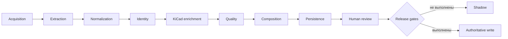
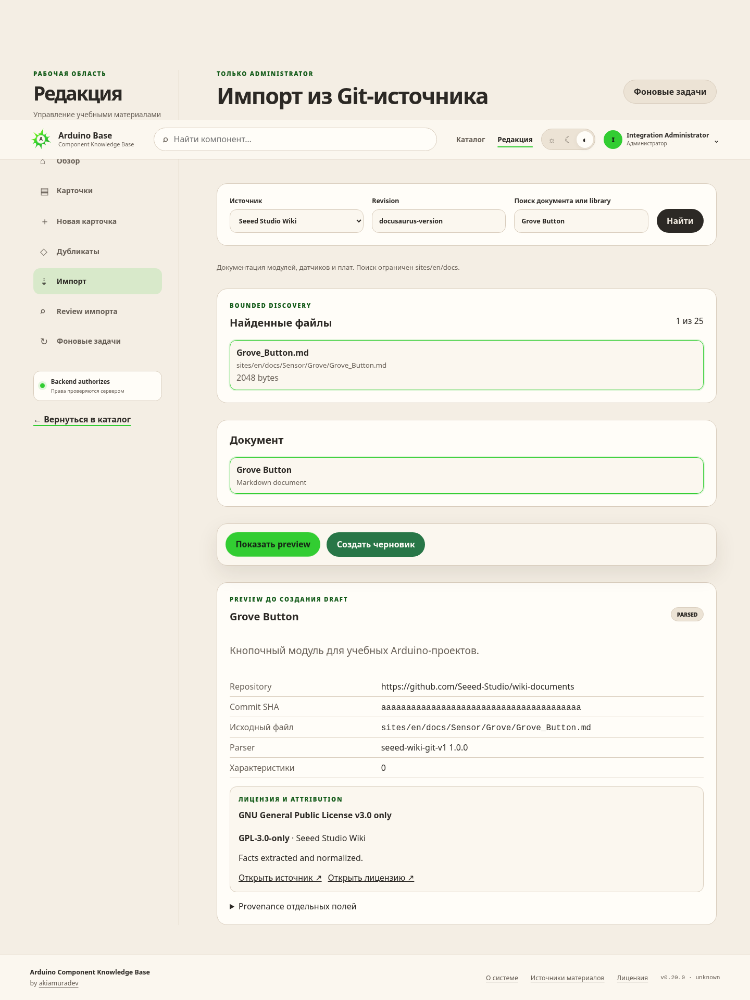
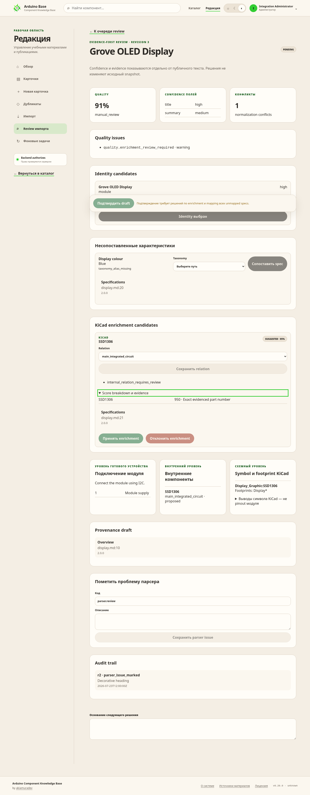

# Развитие импорта компонентов

Документ описывает текущее состояние evidence-first импорта и условия его включения как
основного конвейера. История реализации хранится в Git; здесь остаются только действующие
контракты, ограничения и следующие работы.

Версия приложения: `1.0.0`.

## Текущее состояние

- Legacy repository flow остаётся authoritative и создаёт только каталожный `draft`.
- Evidence-first pipeline реализован полностью, но работает только в режимах `disabled`
  (по умолчанию) и `shadow`; значение `primary` намеренно отсутствует.
- Review workspace позволяет проверить и подтвердить candidate draft, но ещё не создаёт и не
  публикует catalogue component.
- KiCad используется только как enrichment для identity из Seeed Wiki, а не как источник
  массового создания карточек.

## Архитектура


```mermaid
flowchart LR
    A[Acquisition] --> E[Extraction]
    E --> N[Normalization]
    N --> I[Identity]
    I --> K[KiCad enrichment]
    K --> Q[Quality]
    Q --> C[Composition]
    C --> P[Persistence]
    P --> R[Human review]
    R --> G{Release gates}
    G -->|не выполнены| S[Shadow]
    G -->|выполнены| W[Authoritative write]
```

Основной код находится в `src/arduino_component_kb/imports/pipeline/`. Domain models и stage
contracts не зависят от FastAPI, SQLAlchemy, Redis, Dramatiq или HTTP. Инфраструктурные adapters
реализуют contracts, а API и workers подключаются к orchestrator через явный режим запуска.

| Стадия | Ответственность |
|---|---|
| Acquisition | Получить bounded artifact и зафиксировать источник и revision |
| Extraction | Извлечь raw facts с evidence без догадок и нормализации |
| Normalization | Применить версионированные semantic rules, сохранив raw values |
| Identity | Выдать ранжированные kind/category/identity candidates с объяснением |
| Enrichment | Предложить KiCad relations, не изменяя карточку |
| Quality | Оценить полноту, конфликты и маршрут review |
| Composition | Сформировать deterministic review draft без выдуманного текста |
| Persistence | Идемпотентно сохранить immutable snapshots и audit state |

## Инварианты

1. Parser создаёт только draft и никогда не публикует карточку.
2. Отсутствующий source text не генерируется, unknown data не скрывается.
3. Каждый факт хранит raw value, evidence, source и parser/rule version.
4. Repository revision разрешается до полного immutable commit SHA.
5. License и attribution snapshot обязательны; composer их не угадывает.
6. Module connection и KiCad symbol pinout хранятся раздельно.
7. Candidate payload immutable; reviewer decision записывается отдельным audit action.
8. Mutation требует administrator permission, session, CSRF и expected revision.
9. Повтор одного input не создаёт новый aggregate.
10. Shadow failure не ломает legacy import и не раскрывает raw source в логах.

## Реализовано

| Блок | Результат |
|---|---|
| Baseline и contracts | Golden fixtures, typed stages, immutable context и безопасные ошибки |
| Seeed extraction | Bounded Markdown/MDX parser без исполнения YAML objects, JSX и code |
| Normalization | Profile-aware taxonomy, units, aliases и явные conflicts/unmapped facts |
| Identity | Взвешенные candidates, confidence и score breakdown без first-match fallback |
| KiCad | Версионированный индекс, bounded S-expression parser и explainable matcher |
| Quality/composition | Детерминированный quality route и review draft без fallback prose |
| Persistence | Идемпотентные snapshots, enrichment lifecycle и append-only review audit |
| Shadow | Stage timeouts, safe retries, structured metrics и legacy isolation |
| Review UI | Identity/specification/enrichment decisions с optimistic locking |
| Distribution | Проверяемый KiCad index artifact с revision, SHA-256 и manifest |
| Metrics | Human-labelled precision/recall по финальным reviewer actions |

### UI-контракты

Снимки построены на детерминированных fixtures и показывают интерфейс, а не production data.





## Следующая работа

### 1. Калибровка

- разметить реальные false positive/false negative cases;
- изменять matcher, identity и quality thresholds только новой версией rules;
- добавить regression fixture для каждого принятого изменения;
- подтвердить согласованный precision gate на human-labelled sample.

### 2. Ограниченный real-source shadow run

- зафиксировать Seeed и KiCad full revisions и allowlisted sample;
- использовать validated non-empty KiCad index;
- сравнить legacy/evidence-first failures, latency, coverage и reviewer outcomes;
- сохранить privacy-safe отчёт с pipeline/rule/index versions;
- принять одно решение: продолжить к switch, перекалибровать или остаться в shadow.

### 3. Authoritative switch

Начинается только после успешной калибровки и real-source run:

1. Добавить default-off primary flag с fail-closed проверкой gates.
2. Связать confirmed review draft с catalogue component отдельным audited action.
3. Запретить publication при unresolved identity, specification, enrichment или conflict.
4. Включать canary на ограниченном sample и автоматически возвращаться в `disabled` при
   нарушении gates.
5. Сохранить legacy flow на всё окно отката.

### 4. Удаление legacy

После согласованного rollback window:

- остановить legacy KiCad-card imports;
- удалить category first-match и fallback prose;
- заменить `ParsedRepositoryComponent` consumers;
- удалить старую schema только отдельной reversible Alembic migration после backup;
- обновить architecture, threat model, data model и operations.

## Условия переключения

Primary mode запрещён, пока не выполнены все пункты:

- online shadow worker использует pinned непустой KiCad index;
- подтверждённые review actions дают достаточный human-labelled sample;
- thresholds и failure/coverage/latency gates зафиксированы версиями и тестами;
- real-source report воспроизводим и не содержит source payload или персональных данных;
- rehearsal возвращает систему в `ACKB_IMPORT_PIPELINE_MODE=disabled`;
- confirmed draft безопасно связывается с catalogue lifecycle без автоматической публикации.

## Совместимость до удаления legacy

Нельзя ломать `/api/v1/import-jobs`, repository discovery/entries/preview, polling и retry;
RBAC/CSRF/session/idempotency; source allowlists и SSRF limits; license snapshots; frontend
contracts; reversible migrations и существующие parser fixtures.

Shadow включается только с проверенным индексом:

```env
ACKB_KICAD_INDEX_ARTIFACT_PATH=/var/lib/ackb/kicad/index-<revision>.json
ACKB_KICAD_INDEX_EXPECTED_REVISION=<40-character-commit>
ACKB_KICAD_INDEX_EXPECTED_SHA256=<64-character-index-digest>
ACKB_IMPORT_PIPELINE_MODE=shadow
```

Rollback: вернуть `ACKB_IMPORT_PIPELINE_MODE=disabled` и перезапустить parser worker.

## Проверка

```bash
uv run pytest -q \
  tests/test_extracted_facts.py \
  tests/test_seeed_fact_extractor.py \
  tests/test_semantic_normalization.py \
  tests/test_identity_resolution.py \
  tests/test_kicad_enrichment.py \
  tests/test_kicad_matcher.py \
  tests/test_quality_evaluation.py \
  tests/test_card_composition.py \
  tests/test_pipeline_persistence.py \
  tests/test_pipeline_orchestrator.py \
  tests/test_shadow_import.py \
  tests/test_import_review_api.py
```

Integration tests запускаются отдельно с `ACKB_RUN_INTEGRATION=1`. Статус roadmap меняется
только вместе с кодом, тестом или проверяемым decision artifact; отдельные stage-планы в
`docs/imports` не создаются.
