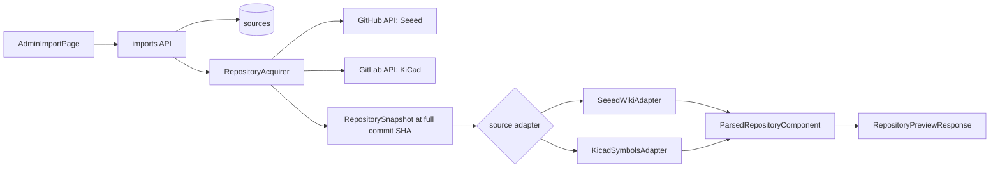
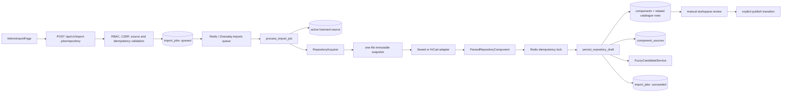
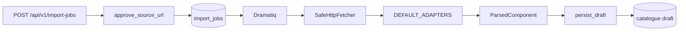

# Current import pipeline baseline

Status: stage 0 baseline for the parser refactor. This document describes release `0.21.0`
before the new import domain is introduced. It is descriptive: the behavior below is not the
target architecture.

## Scope and invariants

The application currently has two import paths:

1. legacy website imports for allowlisted URLs;
2. immutable repository imports for Seeed Wiki and official KiCad symbol libraries.

Both paths create catalogue drafts. Neither parser can publish a component. Publication remains a
separate authenticated workspace action and checks source licensing, duplicate state and required
catalogue fields.

Stage 0 adds fixtures, golden output and this map only. It does not change parser or persistence
behavior.

## Actual flows

### Repository discovery and preview



Discovery resolves a caller-supplied tag or revision to a full commit SHA and lists a bounded set
of supported files. Preview acquires one file, parses it and returns the normalized fields without
creating an `ImportJob`, component or source relation.

### Repository import and draft creation



Seeed and KiCad currently enter the same persistence method. Consequently a selected KiCad symbol
creates a standalone catalogue draft just like a Seeed page. There is no Seeed-to-KiCad relation,
candidate matcher or enrichment lifecycle in release `0.21.0`.

### Legacy website import



This path uses the Arduino-Tex, Portal-PK and AlexGyver adapter contracts. Source records currently
disable those upstreams according to their licensing/policy state, but their code and tests remain
part of the compatibility surface.

## Entry points and responsibilities

| Area | File | Current responsibility |
| --- | --- | --- |
| HTTP API | `src/arduino_component_kb/api/imports.py` | URL import, repository discovery, entry discovery, preview, job creation and job lookup; enforces RBAC, CSRF and idempotency headers. |
| Admin jobs API | `src/arduino_component_kb/api/jobs.py` | Lists import jobs and performs audited manual retries. |
| Frontend API | `frontend/src/api/client.ts`, `frontend/src/api/contracts.ts` | Typed client contracts and extraction of backend error codes. Unknown/non-JSON errors become `request_failed`. |
| Import UI | `frontend/src/pages/AdminImportPage.tsx` | Selects source/revision/file/symbol, displays preview, creates a job and polls it until terminal status. |
| Jobs UI | `frontend/src/pages/AdminJobsPage.tsx` | Displays import status, attempts, phase/error and retry action. |
| Queue | `src/arduino_component_kb/imports/queue.py`, `tasks.py` | Sends a UUID through Dramatiq and maps retryable failures to bounded broker retries. |
| Orchestration | `src/arduino_component_kb/imports/processor.py` | Loads and leases a job, acquires source data, chooses an adapter, parses, locks idempotency, persists and maps failures. |
| Repository acquisition | `src/arduino_component_kb/imports/acquisition.py` | Resolves immutable GitHub/GitLab revisions and reads or discovers bounded allowlisted files with SSRF and size controls. |
| Website acquisition | `src/arduino_component_kb/imports/transport.py`, `urls.py` | Pins allowlisted public addresses and performs bounded HTTP fetches for legacy URL adapters. |
| Repository contract | `src/arduino_component_kb/imports/repository_domain.py` | Immutable snapshot, entry, parse status, field provenance, license snapshot and `ParsedRepositoryComponent`. |
| Adapter protocol | `src/arduino_component_kb/imports/adapters/repository.py` | `validate_revision`, `discover` and `parse_entry` interface. |
| Seeed parser | `src/arduino_component_kb/imports/adapters/seeed_wiki.py`, `markdown.py` | Non-executing Markdown/MDX parsing, section aliases, immediate spec normalization, resource filtering and keyword category hint. |
| KiCad parser | `src/arduino_component_kb/imports/adapters/kicad_symbols.py`, `sexpr.py` | Allowlisted S-expression parsing of one named symbol, properties, pins, units, datasheet and footprint filters. |
| Spec registry | `src/arduino_component_kb/imports/specifications.py` | Small application-controlled alias map; returns `None` for an unknown specification. |
| Persistence | `src/arduino_component_kb/imports/repository.py` | Creates/reuses catalogue drafts, maps category/specs, stores provenance/license snapshot and generates duplicate candidates. |
| ORM | `src/arduino_component_kb/imports/models.py` | `Source`, `ComponentSource` and `ImportJob`. |
| Dry run | `src/arduino_component_kb/imports/dry_run.py` | Parses one caller-provided local file at a full commit SHA without infrastructure or persistence. |
| Catalogue review | `src/arduino_component_kb/api/catalog.py`, `catalog/service.py` | Manual draft editing and explicit draft-to-published lifecycle with source and duplicate checks. |

## Current data contracts

### Parser result

`ParsedRepositoryComponent` contains source identity, parser identity, status, warnings,
`normalized_fields`, field-level provenance, an immutable licence snapshot and a fixed `draft`
status. It is already close to a catalogue projection rather than a collection of extracted facts.

The Seeed `normalized_fields` contract currently uses some or all of:

- `title`, `summary`, `description`, `category_hint`;
- `specifications` as `{key, label, value}` objects;
- `resource_links` as `{label, url}` objects.

The KiCad contract currently uses:

- `library_name`, `symbol_name`, `reference`, `value`, `description`, `keywords`;
- `datasheet_url`, `footprint`, `footprint_filters`, `extends`, `format_version`;
- `pins` with `number`, `name`, `electrical_type` and `unit`;
- `category_hint`.

### Database records

| Table/model | Import dependency |
| --- | --- |
| `sources` / `Source` | Registered host/repository, enablement, licence and content permissions. |
| `import_jobs` / `ImportJob` | Durable request identity, attempts, status, parse result metadata, warning list, metrics and resulting draft ID. |
| `component_sources` / `ComponentSource` | Source-to-component relation, immutable revision/file identity, imported fields, provenance and licence snapshot. |
| `components` / `Component` | The draft or published catalogue card created directly by persistence. |
| catalogue relation tables | Specifications, categories, aliases/tags and revision snapshots composed during draft creation. |
| duplicate candidate tables | Fuzzy candidates generated immediately after a new imported draft is created. |

`ComponentSource` is a source attribution relation, not an enrichment relation. It has no
`relation_type`, confidence, evidence decision, reviewer decision or stale/conflict lifecycle.

### Status and review lifecycle

- Import job: `queued → running → succeeded`; transient failures use `retrying`; terminal errors
  use `failed` and an `error_code`.
- Parse status: `parsed`, `parsed_with_warnings`, `unsupported_document`, `source_drift`,
  `invalid_metadata`, `license_missing`, `failed`.
- Component: `draft → published → archived`.
- Only `parsed` and `parsed_with_warnings` repository results are persisted.
- The import worker always creates a draft. A teacher or administrator separately edits and
  publishes it through the workspace.
- Publication rejects missing licensed source snapshots, unresolved high-confidence duplicates,
  blank descriptions and invalid lifecycle transitions.

## Baseline fixtures and golden output

The deterministic baseline is stored in:

- `tests/fixtures/seeed/` — 8 Markdown/MDX cases;
- `tests/fixtures/kicad/` — 8 KiCad library cases;
- `tests/golden/imports/repository_parsers_v1.json` — current normalized fields, status and warnings;
- `tests/test_repository_parser_baseline.py` — parses every case at a fixed revision and timestamp,
  verifies field-provenance coverage and compares against the golden file.

Seeed profiles include sensor, display, actuator/error-tolerant MDX, input, communication, board,
power and legacy unknown-section documents. The golden intentionally records current defects such
as duplicated summary/description and dropped unknown specifications.

KiCad profiles include sensor, display controller, MCU with multiple units and inheritance, relay
without a datasheet, switch filters, unknown electrical type, malformed S-expression and a library
outside the allowlist.

Run the focused baseline with:

```shell
uv run pytest -q tests/test_repository_parser_baseline.py tests/test_repository_adapters.py
```

## Known architectural debt captured by the baseline

1. Acquisition and parsing are separated, but extraction, normalization, classification and card
   shaping are combined inside each adapter.
2. Seeed assigns `description = summary`, so the two semantic fields are indistinguishable.
3. Seeed invents a summary when the source has none; persistence can generate another summary for
   short repository results.
4. Unknown and duplicate Seeed specification rows are discarded and reduced to the warning
   `untrusted_specification_ignored`; their labels, values and evidence are lost.
5. Seeed recognizes only a small set of sections. Features, pinout and usage may influence warnings
   or specifications but are not preserved as independent facts/card sections.
6. Seeed category selection is ordered first-match keyword logic over title/file path. It returns
   `other` without candidates, score breakdown or review route.
7. KiCad category selection is a library-prefix mapping. Generic symbols are importable and there
   is no evidence-based relation to a Seeed identity.
8. A KiCad symbol is persisted as a standalone component draft. There is no index, candidate
   cache, enrichment provider or separation between module pinout and IC pinout.
9. Provenance is attached to a projected field, but it does not retain every raw fact, selector,
   raw value and extraction method as an independently reviewable object.
10. `process_import_job` is a monolithic orchestrator. It has no typed per-stage context or failure
    result, and unexpected persistence/runtime errors become generic transient retries.
11. The UI exposes a flattened preview. It has no identity candidates, field confidence, unmapped
    facts, conflicts, relation types or enrichment decisions.
12. The frontend emits `request_failed` whenever an error response is non-JSON or does not contain
    `detail.code`, hiding the backend failure category from the reviewer.

## Compatibility contracts that must not be broken accidentally

- Existing routes and response fields under `/api/v1/import-jobs`, `/repository/discovery`,
  `/repository/entries`, `/repository/preview`, `/repository` and `/{job_id}`.
- Admin job listing/retry behavior and import statuses used by polling UIs.
- RBAC: repository discovery/import is administrator-only; legacy import and job lookup permit the
  current teacher/administrator roles; CSRF remains mandatory for mutations.
- A parser result cannot publish directly; imported content remains a draft pending manual review.
- Source allowlists, immutable full-SHA resolution, SSRF/DNS checks, TLS validation, disabled proxy
  inheritance, redirect denial, timeouts and response/file/count bounds.
- Source permission and licence snapshot checks at import and publication time.
- Idempotency keys, unique repository entry identity and Redis locking semantics.
- Existing `ParsedComponent`, `ParsedRepositoryComponent`, frontend TypeScript contracts and
  catalogue `DraftData` mapping until the explicit pipeline switch stage.
- Existing source provenance returned in workspace/catalogue responses.
- Existing legacy adapters and their tests until the planned legacy-removal stage.
- Existing database columns and reversible migration chain until new persistence is deployed and
  the compatibility window closes.

## Stage 1 boundary

The next stage may add a parallel import-domain package and typed interfaces. It must not connect
that package to these endpoints, jobs or persistence methods. This baseline remains the regression
oracle until shadow mode and the explicit switch stages.
