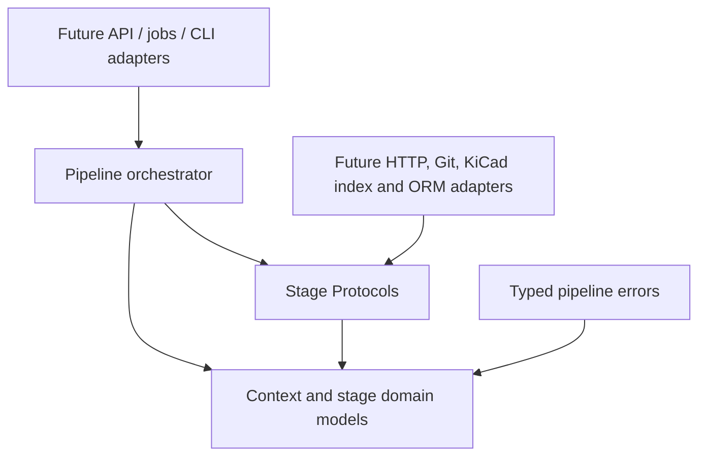

# Target import architecture

Status: stage 3 extraction implementation. The package described here exists in parallel with the release
`0.21.0` import flow and is not connected to HTTP endpoints, Dramatiq jobs, adapters, ORM models or
catalogue persistence.

The current implementation and compatibility surface are documented in
[`current-state.md`](current-state.md).

## Architectural decision

The target flow is:

```text
acquisition
→ extraction
→ semantic normalization
→ identity resolution
→ enrichment
→ quality evaluation
→ card composition
→ persistence
```

Seeed Wiki is the primary source for a component card. KiCad is an enrichment provider for an
identity extracted from Seeed; it is not a bulk card source. Composition is the first stage allowed
to shape publication-facing fields.

Stages 1–3 establish the boundaries, raw fact model and Seeed extractor. Normalized facts, component
identity, enrichment relations, quality reports and review drafts are introduced by their dedicated
later stages.

## Package tree

```text
src/arduino_component_kb/imports/pipeline/
├── __init__.py
├── context.py
├── errors.py
├── orchestration.py
├── contracts/
│   ├── __init__.py
│   ├── acquisition.py
│   ├── extraction.py
│   ├── normalization.py
│   ├── identity.py
│   ├── enrichment.py
│   ├── evaluation.py
│   ├── composition.py
│   └── persistence.py
├── extractors/
│   ├── __init__.py
│   ├── markdown.py
│   └── seeed.py
└── models/
    ├── __init__.py
    ├── artifact.py
    ├── extracted_facts.py
    └── provenance.py
```

The extra `pipeline` namespace is intentional. The existing package already contains
`imports/acquisition.py`, adapters, processor and repository modules used by production. Reusing
those paths for the new domain would create accidental coupling and change existing imports before
the explicit switch stage.

## Dependency direction



Allowed dependencies:

- domain context depends only on the Python standard library;
- stage contracts depend only on domain context/result types;
- orchestration depends only on context and abstract steps;
- future infrastructure implements contracts and may depend on HTTP, filesystem, cache or ORM;
- API/jobs depend on orchestration through an adapter introduced during the feature-flag stage.

Forbidden dependencies:

- the domain package must not import FastAPI, SQLAlchemy, Redis, Dramatiq, `httpx2` or catalogue ORM
  classes;
- extractors must not invoke persistence or create catalogue cards;
- providers and evaluators must not mutate prior-stage values;
- legacy production modules must not import `imports.pipeline` until the planned wiring stage.

The unit suite includes a static guard for the last rule.

## Stage contracts

All interfaces are structural `Protocol` contracts. Their input and output values are generic so
later stages can introduce concrete immutable domain types without weakening the contracts with
`Any` or dictionaries.

| Stage | Protocol | Method | Responsibility boundary |
| --- | --- | --- | --- |
| acquisition | `SourceAcquirer[Request, Artifact]` | `acquire` | Obtain a bounded source artifact; do not interpret component meaning. |
| extraction | `FactExtractor[Artifact, Facts]` | `extract` | Convert source syntax into evidenced raw facts. |
| normalization | `FactNormalizer[Facts, Normalized]` | `normalize` | Apply deterministic semantic rules while retaining raw values. |
| identity | `IdentityResolver[Normalized, Identity]` | `resolve` | Produce explainable component and category candidates. |
| enrichment | `EnrichmentProvider[Input, Enrichment]` | `enrich` | Propose external facts/relations without changing a card. |
| evaluation | `QualityEvaluator[Input, Quality]` | `evaluate` | Report readiness and issues; never repair or generate data. |
| composition | `CardComposer[Input, Draft]` | `compose` | Build a deterministic review draft from accepted inputs. |
| persistence | `ImportPersistenceGateway[Draft, Persisted]` | `persist` | Persist through an infrastructure adapter with idempotency. |

Composite inputs required by enrichment, evaluation and composition will be explicit dataclasses,
not variadic parameters or untyped mappings.

## Pipeline context and results

`ImportPipelineContext` is immutable and contains only cross-stage execution identity:

- `run_id`;
- registered `source_key` and bounded `source_locator`;
- `pipeline_version`;
- timezone-aware start time;
- ordered immutable `StageExecution` records.

It deliberately does not contain source payloads or facts. Each contract receives its typed input
and returns `StageResult[T]`, which couples a typed value to the advanced context and completed
stage. This prevents the context from becoming an untyped property bag.

Context validation guarantees:

- stages form an exact prefix of the canonical order;
- stages do not overlap and cannot precede the run;
- a result identifies the same stage as the last context execution;
- source/run identity cannot be replaced by an orchestration step;
- JSON serialization is deterministic and round-trippable.

The current `PipelineOrchestrator` is a sequencing stub. It validates that all eight stages are
present exactly once and that each abstract step advances the same context by one stage. It carries
no component payload and is intentionally not production-ready; the real typed data flow arrives
after the stage models exist.

## Error taxonomy

All new failures inherit `ImportPipelineError`, carry a bounded machine-readable `code`, declare
whether retry is safe, and serialize without raw exception text.

| Error | Category | Stage |
| --- | --- | --- |
| `AcquisitionError` | `acquisition` | acquisition |
| `ParsingError` | `parsing` | extraction |
| `NormalizationError` | `normalization` | normalization |
| `IdentityError` | `identity` | identity |
| `EnrichmentError` | `enrichment` | enrichment |
| `QualityError` | `quality` | evaluation |
| `CompositionError` | `composition` | composition |
| `PersistenceError` | `persistence` | persistence |

Retryability is explicit per error instance. A future orchestrator may retry only acquisition or
other proven-idempotent operations; it must not infer retryability from an arbitrary exception.

## Compatibility and rollout

During stages 1–10:

- the current Seeed and KiCad adapters continue returning `ParsedRepositoryComponent`;
- current endpoints, frontend contracts, worker and `ImportRepository` remain the source of truth;
- current golden fixtures remain the regression oracle;
- new domain models and implementations are exercised only by unit/golden/dry-run tests.

Stage 11 may connect the new orchestrator behind a disabled feature flag and run it in shadow mode.
Only the explicit switch stage may make the new flow authoritative. Existing models and adapters
are removed only after acceptance metrics and rollback requirements are satisfied.

## Stage 2 implementation

Stage 2 defines `ExtractedFacts` and evidence/provenance models as the concrete future output of
`FactExtractor`. The model preserves raw and unmapped data, contains no UI/card fields and remains
unwired from production. Its complete contract is documented in
[`extracted-facts.md`](extracted-facts.md).

## Stage 3 implementation

Stage 3 provides the non-executing `SeeedFactExtractor`, safe source-retaining Markdown/MDX
primitives and a 15-profile golden corpus. The extractor separates summaries, description sections,
features, applications, usage, raw specifications, module pinout, identity candidates, resources,
images and unmapped facts. Its behavior and completeness baseline are documented in
[`seeed-extractor.md`](seeed-extractor.md).
